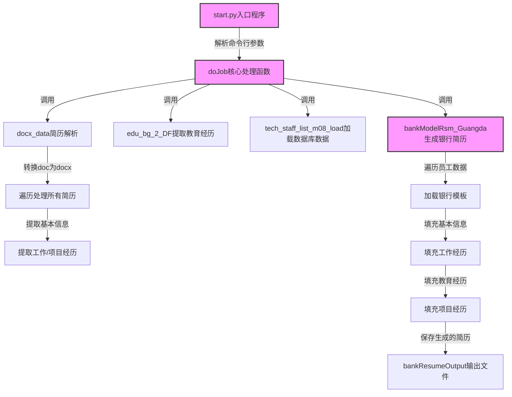

# 银行简历生成系统项目分析报告

## 1. 项目概述

本项目是一个自动化的银行简历生成系统，主要功能是将Word格式的员工简历转换为符合特定银行要求的标准格式简历。系统通过解析Word简历、提取关键信息、结合数据库数据，最终生成符合银行模板的新简历文档。

**主要功能特点：**
- 批量解析Word格式简历
- 从数据库获取员工补充信息
- 支持多种银行模板（光大银行、南京银行、交通银行）
- 自动处理文档格式转换（doc转docx）
- 详细的日志记录系统

## 2. 系统架构与执行流程

### 2.1 系统架构


系统采用模块化设计，主要包含以下核心模块：
- **入口模块**：处理命令行参数和启动主流程
- **简历解析模块**：解析Word格式简历并提取信息
- **数据加载模块**：从数据库获取员工补充信息
- **模板填充模块**：将数据填充到银行特定模板
- **工具函数模块**：提供各种辅助功能
- **日志模块**：记录系统运行状态和错误信息

### 2.2 执行流程



## 3. 核心功能模块

### 3.1 入口模块 (start.py)

入口模块负责处理命令行参数、初始化日志系统并调用核心处理函数。

**主要功能：**
- 解析命令行参数（简历文件夹路径、银行模板路径、银行名称）
- 验证输入参数的有效性
- 调用`doJob`函数开始处理流程
- 记录系统启动和结束日志

**参数说明：**
- `--docxResumeDir`：Word版简历存放文件夹，默认值为`./sources/RESUME`
- `--bankResumeModelPath`：银行简历模板文件路径，默认值为`./sources/RESUME_MODEL/1、优先-光大银行简历模板.docx`
- `--bankName`：银行名称（用于存放转换后简历的文件夹名），默认值为`光大银行`

<mcfile name="start.py" path="d:\github\11-resume_generator\rsm2bank_v5\rsm2bank_v5\start.py"></mcfile>

### 3.2 简历解析模块 (docxResume2DF_v1.py)

该模块负责解析Word格式的简历文件，提取员工的基本信息、工作经历、项目经历和教育经历。

**主要功能：**
- 将doc格式文件转换为docx格式
- 遍历文件夹中所有简历文件
- 从简历中提取基本信息、工作经历、项目经历
- 从基本信息中解析教育经历
- 处理异常情况，记录错误日志

**核心函数：**
- `docx_data`：遍历文件夹中简历，解析数据为基础信息和项目/工作经历数据
- `edu_bg_2_DF`：从基本信息表提取教育经历信息
- `Resume_Data2table`：将单个简历文件解析为数据表

<mcfile name="docxResume2DF_v1.py" path="d:\github\11-resume_generator\rsm2bank_v5\rsm2bank_v5\core\docxResume2DF_v1.py"></mcfile>

### 3.3 数据加载模块 (dbLoadDF.py)

该模块负责从数据库加载技术人员名单数据，为生成银行简历提供补充信息。

**主要功能：**
- 连接到MySQL数据库
- 根据员工ID查询技术人员名单
- 将查询结果转换为DataFrame格式
- 关闭数据库连接

**核心函数：**
- `tech_staff_list_m08_load`：从数据库加载技术人员名单数据

**数据库配置：**
- 主机：`vip.frpee.com`
- 端口：`11651`
- 数据库：`rpa_backup`
- 用户名：`root`
- 密码：`300348`

<mcfile name="dbLoadDF.py" path="d:\github\11-resume_generator\rsm2bank_v5\rsm2bank_v5\core\dbLoadDF.py"></mcfile>

### 3.4 模板填充模块 (bankModelGuangda.py)

该模块负责将解析和加载的数据填充到银行特定的简历模板中，并生成最终的简历文档。

**主要功能：**
- 加载银行简历模板
- 遍历所有员工数据
- 将员工基本信息填充到模板中
- 将工作经历、教育经历、项目经历填充到模板中
- 处理表格合并和格式调整
- 保存生成的简历文档

**核心函数：**
- `bankModelRsm_Guangda`：根据银行模板生成简历

<mcfile name="bankModelGuangda.py" path="d:\github\11-resume_generator\rsm2bank_v5\rsm2bank_v5\core\bankModelGuangda.py"></mcfile>

### 3.5 工具函数模块 (tools.py)

该模块包含各种辅助函数，为其他模块提供通用功能支持。

**主要功能：**
- 文件操作（复制、查找、类型判断）
- 文档格式转换（doc转docx）
- 数据库操作（连接、查询、插入）
- 表格处理（查找单元格位置、合并单元格）
- 银行简历输出

**核心函数：**
- `DataBase`：数据库操作类
- `doc2docx`/`doc2docx_dir`：文档格式转换
- `bankResumeOutput`：输出生成的银行简历
- `find_pos_bgn_end_c`/`find_pos_bgn_end_r`：查找表格中单元格位置
- `df2db`：DataFrame数据批量导入数据库

<mcfile name="tools.py" path="d:\github\11-resume_generator\rsm2bank_v5\rsm2bank_v5\core\tools.py"></mcfile>

### 3.6 日志模块 (log_settings.py)

该模块负责配置和初始化日志系统，记录系统运行状态和错误信息。

**主要功能：**
- 配置日志格式和级别
- 设置日志文件的滚动策略
- 提供日志记录接口

**日志配置：**
- 日志级别：INFO
- 日志文件：`./log/rsm2bank_YYYY-MM-DD-HH-MM-SS.log`
- 日志滚动：按天滚动，保留60天
- 日志格式：包含时间戳、文件名、行号、日志级别和消息

<mcfile name="log_settings.py" path="d:\github\11-resume_generator\rsm2bank_v5\rsm2bank_v5\logconfig\log_settings.py"></mcfile>

## 4. 主要类和函数

### 4.1 核心处理函数

#### `doJob`

**功能**：根据不同模板选择转换函数，协调整个简历转换流程。

**参数**：
- `BASE_DIR`：项目所在路径
- `docxResumeDir`：Word版简历存放文件夹
- `bankResumeModelPath`：银行简历模板文件路径
- `bankName`：银行名称（用于存放转换后简历的文件夹名）

**处理流程**：
1. 调用`docx_data`解析Word简历
2. 调用`edu_bg_2_DF`提取教育经历
3. 调用`tech_staff_list_m08_load`加载数据库数据
4. 调用`bankModelRsm_Guangda`生成银行格式简历

<mcsymbol name="doJob" filename="main_test.py" path="d:\github\11-resume_generator\rsm2bank_v5\rsm2bank_v5\core\main_test.py" startline="59"></mcsymbol>

### 4.2 简历解析相关函数

#### `docx_data`

**功能**：遍历Word简历文件夹中的所有简历，解析数据为基础信息和项目/工作经历数据。

**参数**：
- `docxResumeDir`：简历所在文件夹
- `dir_doc`：文件目录(被替换为docx的doc存放到该文件夹)
- `target_dir`：未解析的格式有问题简历存放文件夹

**返回值**：
- `jl_df_tmp`：基础信息数据
- `Project_Data_tmp`：项目及工作经历数据

<mcsymbol name="docx_data" filename="docxResume2DF_v1.py" path="d:\github\11-resume_generator\rsm2bank_v5\rsm2bank_v5\core\docxResume2DF_v1.py" startline="249"></mcsymbol>

#### `edu_bg_2_DF`

**功能**：从基本信息表提取教育经历信息，将单行数据拆分为多行。

**参数**：
- `jl_df_tmp`：基本信息DataFrame

**返回值**：
- `edu_bg_split`：教育经历数据DataFrame
- `exception_empl_ID_df`：异常员工编号DataFrame

<mcsymbol name="edu_bg_2_DF" filename="docxResume2DF_v1.py" path="d:\github\11-resume_generator\rsm2bank_v5\rsm2bank_v5\core\docxResume2DF_v1.py" startline="310"></mcsymbol>

### 4.3 数据库操作相关函数和类

#### `DataBase` 类

**功能**：提供数据库连接和操作的封装类。

**主要方法**：
- `__init__`：初始化数据库连接参数
- `getConn`：建立数据库连接
- `searchSql`：执行查询SQL并返回结果
- `executeSql`：执行SQL语句
- `sql2DataFrame`：执行查询并将结果转换为DataFrame
- `endDB`：关闭数据库连接

<mcsymbol name="DataBase" filename="tools.py" path="d:\github\11-resume_generator\rsm2bank_v5\rsm2bank_v5\core\tools.py" startline="304"></mcsymbol>

#### `tech_staff_list_m08_load`

**功能**：从数据库加载技术人员名单数据。

**参数**：
- `jl_df_tmp`：基本信息DataFrame，用于获取需要查询的员工ID列表

**返回值**：
- `tech_staff_list_m08`：技术人员名单数据DataFrame

<mcsymbol name="tech_staff_list_m08_load" filename="dbLoadDF.py" path="d:\github\11-resume_generator\rsm2bank_v5\rsm2bank_v5\core\dbLoadDF.py" startline="68"></mcsymbol>

### 4.4 模板填充和输出函数

#### `bankModelRsm_Guangda`

**功能**：将员工信息填充到银行简历模板中，生成银行格式的简历。

**参数**：
- 各种DataFrame数据：员工基本信息、项目/工作经历、教育经历、数据库技术人员名单
- 各种映射表：员工基本信息模板映射表、项目/工作经历信息模板映射表、教育经历信息模板映射表、技术人员名单表模板映射表
- 路径和名称：项目所在路径、选择的银行模板路径、银行名称

**处理流程**：
1. 加载银行简历模板
2. 遍历所有员工数据
3. 填写员工基本信息
4. 填写工作经历和教育经历
5. 填写项目经历并处理表格格式
6. 调用`bankResumeOutput`保存生成的简历

<mcsymbol name="bankModelRsm_Guangda" filename="bankModelGuangda.py" path="d:\github\11-resume_generator\rsm2bank_v5\rsm2bank_v5\core\bankModelGuangda.py" startline="36"></mcsymbol>

#### `bankResumeOutput`

**功能**：输出生成的银行简历到指定目录。

**参数**：
- `empl_ID`：员工ID
- `name`：员工名称
- `bankName`：银行名称
- `opt_doc`：填充后的银行模板docx文件
- `BASE_DIR`：项目所在路径

<mcsymbol name="bankResumeOutput" filename="tools.py" path="d:\github\11-resume_generator\rsm2bank_v5\rsm2bank_v5\core\tools.py" startline="27"></mcsymbol>

## 5. 依赖库

| 库名 | 版本 | 用途 | 来源 |
|------|------|------|------|
| python-docx | 未知 | 处理Word文档（.docx） | <mcfile name="docxResume2DF_v1.py" path="d:\github\11-resume_generator\rsm2bank_v5\rsm2bank_v5\core\docxResume2DF_v1.py"></mcfile> |
| pandas | 未知 | 数据处理和分析 | <mcfile name="start.py" path="d:\github\11-resume_generator\rsm2bank_v5\rsm2bank_v5\start.py"></mcfile> |
| numpy | 未知 | 数值计算 | <mcfile name="bankModelGuangda.py" path="d:\github\11-resume_generator\rsm2bank_v5\rsm2bank_v5\core\bankModelGuangda.py"></mcfile> |
| sqlalchemy | 未知 | 数据库ORM框架 | <mcfile name="dbLoadDF.py" path="d:\github\11-resume_generator\rsm2bank_v5\rsm2bank_v5\core\dbLoadDF.py"></mcfile> |
| pymysql | 未知 | MySQL数据库连接驱动 | <mcfile name="dbLoadDF.py" path="d:\github\11-resume_generator\rsm2bank_v5\rsm2bank_v5\core\dbLoadDF.py"></mcfile> |
| comtypes | 未知 | 调用COM组件（用于doc转docx） | <mcfile name="tools.py" path="d:\github\11-resume_generator\rsm2bank_v5\rsm2bank_v5\core\tools.py"></mcfile> |
| magic | 未知 | 文件类型识别 | <mcfile name="tools.py" path="d:\github\11-resume_generator\rsm2bank_v5\rsm2bank_v5\core\tools.py"></mcfile> |
| logging | 内置 | 日志记录 | <mcfile name="log_settings.py" path="d:\github\11-resume_generator\rsm2bank_v5\rsm2bank_v5\logconfig\log_settings.py"></mcfile> |
| argparse | 内置 | 命令行参数解析 | <mcfile name="start.py" path="d:\github\11-resume_generator\rsm2bank_v5\rsm2bank_v5\start.py"></mcfile> |

## 6. 配置参数和文件结构

### 6.1 命令行参数

| 参数名 | 类型 | 默认值 | 说明 |
|--------|------|--------|------|
| --docxResumeDir | string | ./sources/RESUME | Word版简历存放文件夹 |
| --bankResumeModelPath | string | ./sources/RESUME_MODEL/1、优先-光大银行简历模板.docx | 银行简历模板文件路径 |
| --bankName | string | 光大银行 | 银行名称（存放转换后简历的文件夹名） |

### 6.2 文件结构

```
├── __init__.py
├── core/
│   ├── bankModelGuangda.py      # 银行模板填充模块
│   ├── dbLoadDF.py              # 数据库数据加载模块
│   ├── docxResume2DF_v1.py      # 简历解析模块
│   ├── main_test.py             # 主处理流程模块
│   └── tools.py                 # 工具函数模块
├── logconfig/
│   └── log_settings.py          # 日志配置模块
├── sources/
│   ├── RESUME/                  # 存放Word版简历的文件夹
│   ├── RESUME_MODEL/            # 存放银行简历模板的文件夹
│   └── RESUME2BANKMODEL/        # 存放生成的银行简历的文件夹
└── start.py                     # 入口程序
```

### 6.3 模板映射表

系统使用多个映射表来将解析出的数据字段与模板中的字段进行对应：

- `col_mapping`：员工基本信息模板映射表
- `Project_col_mapping`：员工项目/工作经历信息模板映射表
- `col_mapping_edu_bg`：员工教育经历信息模板映射表
- `header_map`：技术人员名单表模板映射表

<mcfile name="docxResume2DF_v1.py" path="d:\github\11-resume_generator\rsm2bank_v5\rsm2bank_v5\core\docxResume2DF_v1.py"></mcfile>

## 7. 输入输出示例

### 7.1 输入示例

**命令行输入**：
```
py start.py --docxResumeDir sources/RESUME --bankResumeModelPath sources/RESUME_MODEL/1、优先-光大银行简历模板.docx --bankName 光大银行
```

**输入文件**：
Word格式的员工简历文件，文件名格式为：`员工编号+姓名+工作简历.docx`
例如：`02264+魏俊杰+工作简历.docx`

### 7.2 输出示例

**输出文件**：
生成的银行格式简历，存放在：`./sources/RESUME2BANKMODEL/银行名称/员工编号-姓名-银行名称.docx`
例如：`./sources/RESUME2BANKMODEL/光大银行/02264-魏俊杰-光大银行.docx`

**日志输出**：
日志文件存放在`./log/rsm2bank_YYYY-MM-DD-HH-MM-SS.log`，包含系统运行状态、错误信息等。

## 8. 代码优化建议

1. **异常处理优化**
   - 当前代码在多处使用`try-except`块捕获异常，但部分异常处理逻辑不完善，建议统一异常处理机制，提高代码的健壮性。
   - 例如，在数据库操作和文件处理过程中，可以增加更具体的异常类型判断和更详细的错误信息记录。

2. **代码结构优化**
   - 部分函数过长且功能复杂，建议进行函数拆分，提高代码的可读性和可维护性。
   - 例如，`bankModelRsm_Guangda`函数可以拆分为加载模板、填写基本信息、填写经历信息等多个子函数。

3. **配置管理优化**
   - 数据库连接信息和其他配置参数硬编码在代码中，建议提取到配置文件中，便于修改和维护。
   - 可以使用JSON或INI格式的配置文件，通过配置文件来管理数据库连接信息、文件路径等。

4. **日志系统优化**
   - 当前日志系统已经比较完善，但可以进一步优化日志级别和日志内容，便于问题排查。
   - 可以增加DEBUG级别的日志，记录更详细的执行过程信息。

5. **性能优化**
   - 在处理大量简历时，可能会遇到性能瓶颈，建议优化文件处理和数据处理逻辑。
   - 例如，可以考虑使用多线程或异步处理来提高处理效率。

6. **代码风格统一**
   - 代码中存在一些不一致的命名风格和格式，建议统一代码风格，提高代码的可读性。
   - 可以使用PEP 8等编码规范来统一代码风格。

通过以上优化建议，可以提高系统的健壮性、可维护性和性能，使系统更加稳定和高效地运行。

## 9. 待办事项和需要注意的开发点

### 9.1 主要待办事项

1. **简历解析功能完善**
   - docx简历解析代码修改
   - docx简历解析入库功能优化

2. **银行模板支持扩展**
   - 南京银行和交通银行模板测试与修改
   - 结构调整：按读取名单+模板输出解析简历

3. **银行模板简历生成流程修改**
   - 入口逻辑开发
   - 从数据库导入数据接口开发
   - 光大银行简历生成的本地测试和服务器测试

4. **项目功能增强**
   - 增加界面
   - 打包成exe文件本地运行

### 9.2 需要注意的开发点

1. **文件格式处理**
   - 简历重复问题：不同部门存在相同员工ID的简历（如02570+李琦睿等）
   - 文档格式问题：部分简历仍为doc格式，需要转换为docx
   - 异常格式调试：如'23718+袁溯+工作简历.docx'

2. **数据处理流程**
   - ERP简历收集解析入库的完整流程（start_erp_rsm2db.py中详细说明）
   - 简历解析异常处理机制
   - 解析结果的CSV文件管理（注意及时剪切到当日文件夹，避免下次解析覆盖）

3. **数据库相关**
   - 数据库连接信息硬编码在代码中
   - MySQL进程查看及死锁后处理方法（已在readme.txt中提供SQL语句）
   - 批量导入机制（batch_size参数控制）

4. **项目结构**
   - 两种简历入库方式：直接解析ERP简历+入库，或通过CSV文件入库
   - 各模块职责明确：main_erp_rsm2db（解析+入库逻辑）、docxResume2DF_v1（简历解析）、upload2db_v1（入库）等

5. **配置注意事项**
   - db_init.py会清空当前数据库表并重新建表，使用时需谨慎
   - 简历收集日期格式（如202506表示2025上半年）
   - 各文件夹路径的正确设置

### 9.3 异常处理机制

项目已实现了异常简历识别和处理流程：
1. 异常简历会被移动到RESUME_DEBUG文件夹
2. 手动修改后存放于RESUME_DEBUG\异常手动修改\已改目录
3. 通过选择2（解析异常简历手动修改后）进行重新解析
4. 重复此过程直到所有简历解析完成