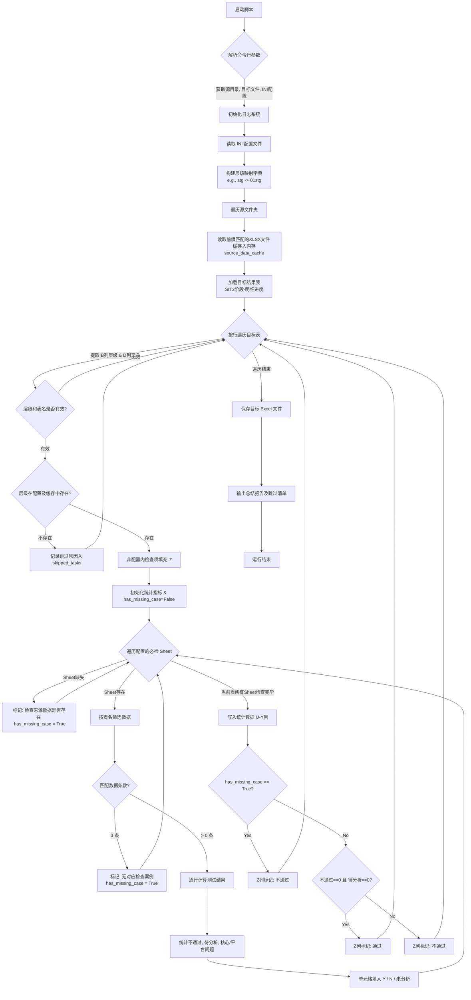

### 1. 执行流程图 (Mermaid)

---

### 2. 执行逻辑说明 

## 🚀 核心执行逻辑

本脚本采用了**“预加载缓存 + 行级独立校验 + 一票否决制”**的核心架构，确保数据处理的高效性与严谨性。完整的执行生命周期如下：

### 阶段一：初始化与数据预加载 (Initialization & Caching)
1. **环境与配置加载**：解析命令行传入的源文件夹 (`-s`)、目标文件 (`-t`) 和配置文件 (`-c`) 路径。建立日志系统，确保持续记录运行状态。
2. **智能层级映射**：读取 `config.ini` 文件，自动建立目标表缩写与源文件前缀的映射关系（例如自动识别目标表中的 `stg` 对应源文件及配置的 `01stg`）。
3. **IO 优化缓存**：遍历源文件夹，寻找符合 `01`~`04` 前缀的映射测试案例 Excel 文件。将其底层 Sheet 数据一次性读入 Pandas 内存字典中，**彻底避免后续处理时的重复磁盘 IO，大幅提升性能**。

### 阶段二：目标表遍历与校验 (Iteration & Validation)
脚本打开目标结果表（专注于 `SIT2阶段-明细进度` sheet 页），逐行向下进行扫描：
1. **层级安全校验**：读取当前行的“层级”和“表名”。如果目标层的层级在配置文件或源文件中未找到，脚本将**安全跳过**该行，避免程序崩溃，并将跳过信息推入待办记录池。
2. **非必填项豁免**：根据 INI 配置，如果当前层级不需要某些检查项（如 `stg` 不需要“上下游数据量对比”），则提前在对应单元格打上 `/`，以示区分。

### 阶段三：数据提取与状态研判 (Extraction & Calculation)
针对当前表名，在对应的源文件 Sheet 页中去筛选数据：
1. **缺失检测（一票否决）**：
   - 找不到必检的 Sheet 页 $\rightarrow$ 填入 `检查来源数据是否存在`。
   - 找到了 Sheet 页，但里面没有该表的数据 $\rightarrow$ 填入 `无对应检查案例`。
   - **触发机制**：只要出现以上任意一种情况，底层布尔值 `has_missing_case` 会被置为 `True`，该行最终测试状态直接判定为**不通过**（防漏测机制）。
2. **数据统计规则**：
   - 当遇到“测试结果”为**不通过**时，累计**不通过**问题总数。
   - 当遇到“测试结果”和“问题描述”均为空白时，判定为**未分析**，只计入待分析条数，不计入问题总数。
   - 同步分类统计“核心问题”与“平台问题”的数量。

### 阶段四：结果落盘与报告生成 (Writing & Reporting)
1. **状态裁定**：在行级数据处理末尾，将所有统计数值写入对应列。如果 `has_missing_case` 为假，再判断：只有在 **不通过数=0 且 待分析数=0** 的情况下，Z列的测试状态才输出为 **通过**；反之输出 **不通过**。
2. **安全保存**：利用 `openpyxl` 保存目标文件，确保原始表格的任何样式、宏或公式不会在写入过程中丢失。
3. **日志汇总**：在终端打印整体执行日志，并详细列出因配置或文件缺失而“跳过处理”的明细清单，同时将日志完整归档至本地 `logs` 目录下。